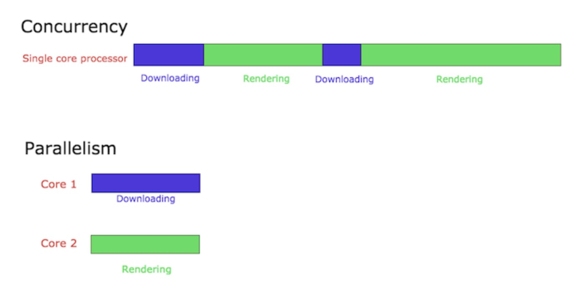
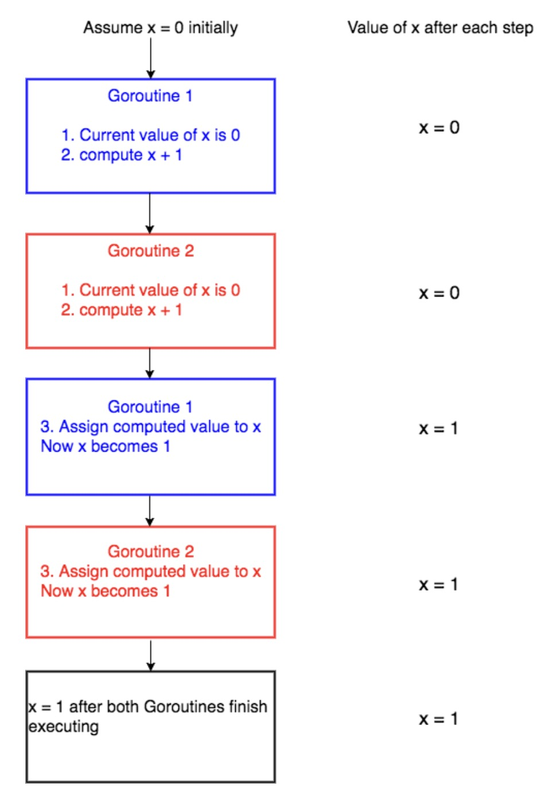

#`Introduction to Concurrency`

Go là ngôn ngữ concurrent (đồng thời) không phải parallel(song song)

## `What is concurrency (đồng thời)?`

- `Concurrency là làm nhiều việc cùng 1 lúc`
- Ex: Hãy xem xét một người đang chạy bộ. Trong lúc chạy bộ buổi sáng, giả sử dây giày của anh ấy bị tuột. Bây giờ người đó ngừng chạy, buộc dây giày rồi lại bắt đầu chạy. `Người có khả năng vừa chạy vừa buộc dây giày, tức` là người có thể giải quyết nhiều việc cùng một lúc :))

## `What is parallelism and how is it different from concurrency?`

- `Sự song song đang làm nhiều việc cùng một lúc. Nghe có vẻ giống với đồng thời nhưng thực tế nó khác.`
- Ex: Hãy hiểu nó rõ hơn với ví dụ chạy bộ tương tự. Trong trường hợp này, giả sử rằng người đó đang chạy bộ và cũng đang nghe nhạc trên iPod của mình. Trong trường hợp này, `một người đang chạy bộ và nghe nhạc cùng một lúc`, tức là anh ta đang làm nhiều việc cùng một lúc. Điều này được gọi là sự song song.

## `Concurrency and Parallelism - A technical point of view`

Giả sử chúng ta đang lập trình một trình duyệt web. Trình duyệt web có nhiều thành phần khác nhau. Hai trong số đó là khu vực hiển thị trang web và trình tải xuống để tải xuống các tệp từ internet. Giả sử rằng chúng ta đã cấu trúc mã trình duyệt theo cách mà mỗi thành phần này có thể được thực thi độc lập (Điều này được thực hiện bằng cách sử dụng các luồng trong các ngôn ngữ như Java và trong Go, chúng ta có thể đạt được điều này bằng cách sử dụng Goroutines , sẽ nói thêm về điều này sau).


    - Khi trình duyệt này được chạy trong bộ xử lý lõi đơn, bộ xử lý sẽ chuyển đổi ngữ cảnh giữa hai thành phần của trình duyệt. Nó có thể tải xuống một tệp trong một thời gian và sau đó nó có thể chuyển sang hiển thị html của trang web mà người dùng yêu cầu. Điều này được gọi là đồng thời. Các quy trình đồng thời bắt đầu tại các thời điểm khác nhau và chu kỳ thực hiện của chúng chồng chéo lên nhau. Trong trường hợp này, quá trình tải xuống và kết xuất bắt đầu ở các thời điểm khác nhau và quá trình thực thi của chúng trùng lặp.

    - Giả sử cùng một trình duyệt đang chạy trên bộ xử lý đa lõi. Trong trường hợp này, thành phần tải xuống tệp và thành phần kết xuất HTML có thể chạy đồng thời trong các lõi khác nhau. Điều này được gọi là sự song song.

`Tính song song không phải lúc nào cũng mang lại thời gian thực hiện nhanh hơn. Điều này là do các thành phần chạy song song có thể phải giao tiếp với nhau.`

Ví dụ: trong trường hợp trình duyệt của chúng tôi, khi quá trình tải xuống tệp hoàn tất, điều này sẽ được thông báo tới người dùng, chẳng hạn như sử dụng cửa sổ bật lên. Giao tiếp này xảy ra giữa thành phần chịu trách nhiệm tải xuống và thành phần chịu trách nhiệm hiển thị giao diện người dùng. Chi phí liên lạc này thấp trong các hệ thống đồng thời. Trong trường hợp các thành phần chạy song song trong nhiều lõi, chi phí giao tiếp này sẽ cao. Do đó, các chương trình song song không phải lúc nào cũng mang lại thời gian thực hiện nhanh hơn!

# `Goroutine`

## `What are Goroutines?`

- Goroutine là các functions or methods chạy đồng thời với các hàm hoặc phương thức khác. Goroutine có thể được coi là những `lightweight threads` thread nhẹ. `Chi phí tạo Goroutine rất nhỏ so với một thread`. Do đó, thông thường các ứng dụng Go có `hàng nghìn Goroutine` chạy đồng thời.

## `Ưu điểm của Goroutine so với thread`

- Goroutines cực kỳ rẻ khi so sánh với thread. Chúng chỉ có kích thước ngăn xếp vài kb và ngăn xếp có thể tăng và giảm tùy theo nhu cầu của ứng dụng trong khi trong trường hợp luồng, kích thước ngăn xếp phải được chỉ định và cố định.

- Các Goroutine được ghép kênh với số lượng luồng hệ điều hành ít hơn. Có thể chỉ có một luồng trong một chương trình có hàng nghìn Goroutine. Nếu bất kỳ Goroutine nào trong khối luồng đó cho biết đang chờ đầu vào của người dùng thì một luồng hệ điều hành khác sẽ được tạo và các Goroutine còn lại sẽ được chuyển sang luồng hệ điều hành mới. Tất cả những điều này đều được bộ thực thi xử lý và chúng tôi, với tư cách là lập trình viên, được trừu tượng hóa khỏi những chi tiết phức tạp này và được cung cấp một API rõ ràng để hoạt động đồng thời.

- Goroutine giao tiếp bằng cách sử dụng các kênh. Các kênh theo thiết kế ngăn chặn tình trạng dồn đuổi xảy ra khi truy cập bộ nhớ dùng chung bằng Goroutine. Các kênh có thể được coi như một đường ống mà Goroutine sử dụng để giao tiếp. Chúng ta sẽ thảo luận chi tiết về các kênh trong hướng dẫn tiếp theo.

## Làm thế nào để bắt đầu một Goroutine?

Đặt tiền tố vào lệnh gọi hàm hoặc phương thức bằng từ khóa `go` và bạn sẽ có một Goroutine mới chạy đồng thời.

```
package main

import (
    "fmt"
    "time"
)

func hello() {
    fmt.Println("Hello world goroutine")
}
func main() {
    go hello()
    time.Sleep(1 * time.Second)
    fmt.Println("main function")
}

```

# `Channels`

## `What are channels`

Các kênh có thể được coi là các `đường dẫn mà Goroutine sử dụng để giao tiếp`. Tương tự như cách nước chảy từ đầu này sang đầu kia trong đường ống, `dữ liệu có thể được gửi từ đầu này và nhận từ đầu kia bằng các kênh`.

## `Declaring channels`

- Mỗi kênh có một loại liên kết với nó. Loại này là loại dữ liệu mà kênh được phép truyền tải. Không có loại nào khác được phép vận chuyển bằng kênh. `chan T is a channel of type T`
- The zero value of a channel is nil.
- nil channels không có ích gì => do đó kênh phải được `defined` bằng cách sử dụng cách tạo tương tự như maps and slices.

```
package main

import "fmt"

func main() {
    var a chan int
    if a == nil {
        fmt.Println("channel a is nil, going to define it")
        a = make(chan int)
        fmt.Printf("Type of a is %T", a)
    }
}

```

- `Gửi và nhận từ một kênh`

```
data := <- a // read from channel a
a <- data // write to channel a

```

- `Gửi và nhận bị chặn theo mặc định`

  - Việc gửi và nhận tới một kênh bị chặn theo mặc định.

    > Điều đó có nghĩa là gì? Khi dữ liệu được gửi đến một kênh, điều khiển sẽ bị chặn trong câu lệnh gửi cho đến khi một số Goroutine khác đọc từ kênh đó. Tương tự, khi dữ liệu được đọc từ một kênh, quá trình đọc sẽ bị chặn cho đến khi một số Goroutine ghi dữ liệu vào kênh đó.

  - Thuộc tính này của các kênh giúp Goroutine giao tiếp hiệu quả mà không cần sử dụng `các khóa rõ ràng hoặc các biến có điều kiện` khá phổ biến trong các ngôn ngữ lập trình khác.

  - Không sao nếu bây giờ điều này không có ý nghĩa. Các phần sắp tới sẽ làm rõ hơn về cách chặn các kênh theo mặc định.

    ```
    package main

    import (
        "fmt"
    )

    func hello(done chan bool) {
        fmt.Println("Hello world goroutine")
        done <- true
    }
    func main() {
        done := make(chan bool)
        go hello(done)
        <-done
        fmt.Println("main function")
    }
    ```

- `Một ví dụ khác về kênh`

  Hãy viết thêm một chương trình nữa để hiểu rõ hơn về các kênh. Chương trình này sẽ in tổng bình phương và lập phương của các chữ số riêng lẻ của một số.

  Ví dụ: nếu 123 là đầu vào thì chương trình này sẽ tính đầu ra là

  hình vuông = (1 _ 1) + (2 _ 2) + (3 _ 3) hình khối = (1 _ 1 _ 1) + (2 _ 2 _ 2) + (3 _ 3 \* 3) đầu ra = hình vuông + hình khối = 50

  Chúng ta sẽ cấu trúc chương trình sao cho các bình phương được tính trong một Goroutine riêng biệt, các khối trong một Goroutine khác và phép tính tổng cuối cùng xảy ra trong Goroutine chính.

  ```
  package main

  import (
      "fmt"
  )

  func calcSquares(number int, squareop chan int) {
      sum := 0
      for number != 0 {
          digit := number % 10
          sum += digit * digit
          number /= 10
      }
      squareop <- sum
  }

  func calcCubes(number int, cubeop chan int) {
      sum := 0
      for number != 0 {
          digit := number % 10
          sum += digit * digit * digit
          number /= 10
      }
      cubeop <- sum
  }

  func main() {
      number := 589
      sqrch := make(chan int)
      cubech := make(chan int)
      go calcSquares(number, sqrch)
      go calcCubes(number, cubech)
      squares, cubes := <-sqrch, <-cubech
      fmt.Println("Final output", squares + cubes)
  }

  ```

## `Deadlock`

Một yếu tố quan trọng cần xem xét khi sử dụng các kênh là sự bế tắc. Nếu một Goroutine đang gửi dữ liệu trên một kênh thì dự kiến ​​một số Goroutine khác sẽ nhận được dữ liệu. Nếu điều này không xảy ra thì chương trình sẽ hoảng loạn khi chạy với Deadlock.

Tương tự, nếu một Goroutine đang chờ nhận dữ liệu từ một kênh thì một số Goroutine khác sẽ ghi dữ liệu lên kênh đó, nếu không chương trình sẽ hoảng loạn.

```
package main

func main() {
    ch := make(chan int)
    ch <- 5
}
```

Trong chương trình trên, một kênh chđược tạo và chúng tôi gửi 5đến kênh ở dòng số. 6 ch <- 5. Trong chương trình này không có Goroutine nào khác nhận dữ liệu từ kênh này ch. Do đó chương trình này sẽ gặp lỗi thời gian chạy

## `Kênh một chiều`

Tất cả các kênh chúng ta đã thảo luận cho đến nay đều là kênh hai chiều, nghĩa là dữ liệu có thể được gửi và nhận trên chúng. Cũng có thể tạo các kênh một chiều, `tức là các kênh chỉ gửi hoặc nhận dữ liệu.`

```
package main

import "fmt"

func sendData(sendch chan<- int) {
    sendch <- 10
}

func main() {
    sendch := make(chan<- int)
    go sendData(sendch)
    fmt.Println(<-sendch)
}
```

Trong chương trình trên, chúng ta tạo kênh chỉ gửi sendchở dòng số. 10. chan<- intbiểu thị kênh chỉ gửi khi mũi tên chỉ tới chan. Chúng tôi cố gắng nhận dữ liệu từ kênh chỉ gửi ở dòng số. 12. Điều này là không được phép và khi chương trình được chạy, trình biên dịch sẽ khiếu nại rằng:

```
./prog.go:12:14: thao tác không hợp lệ: <-sendch (nhận từ loại chỉ gửi chan<- int)
```

> Tất cả đều ổn nhưng việc ghi vào kênh chỉ gửi có ích gì nếu nó không thể đọc được từ đó!

> Đây là nơi chuyển đổi kênh được sử dụng. Có thể chuyển đổi kênh hai chiều thành kênh chỉ gửi hoặc chỉ nhận nhưng không thể ngược lại.

```
package main

import "fmt"

func sendData(sendch chan<- int) {
	sendch <- 10
}

func main() {
	chnl := make(chan int)
	go sendData(chnl)
	fmt.Println(<-chnl)
}
```

> Trong dòng không. 10 của chương trình trên, một kênh hai chiều chnlđược tạo ra. Nó được truyền dưới dạng tham số cho sendDataGoroutine ở dòng số. 11. sendDataChức năng chuyển đổi kênh này thành kênh chỉ gửi ở dòng số. 5 trong tham số sendch chan<- int. Vì vậy, bây giờ kênh chỉ được gửi bên trong sendDataGoroutine nhưng nó là hai chiều trong Goroutine chính. Chương trình này sẽ in 10dưới dạng đầu ra.

## `Closing channels and for range loops on channels`

> Người gửi có khả năng đóng kênh để thông báo cho người nhận rằng sẽ không có thêm dữ liệu nào được gửi trên kênh.

> Người nhận có thể sử dụng một biến bổ sung trong khi nhận dữ liệu từ kênh để kiểm tra xem kênh đã bị đóng hay chưa.

```
v, ok := <- ch
```

> `ok = true` nếu hoạt động gửi thành công tới một kênh đã nhận được giá trị.

> Nếu `ok = false` thì có nghĩa là chúng ta đang đọc từ một kênh đã đóng.

> Giá trị được đọc từ một kênh đóng sẽ là giá trị 0 của loại kênh. Ví dụ: nếu kênh là intkênh thì giá trị nhận được từ kênh đóng sẽ là 0.

```
package main

import (
	"fmt"
)

func producer(chnl chan int) {
	for i := 0; i < 10; i++ {
		chnl <- i
	}
	close(chnl)
}
func main() {
	ch := make(chan int)
	go producer(ch)
	for {
		v, ok := <-ch
		if ok == false {
			break
		}
		fmt.Println("Received ", v, ok)
	}
}

```

The for range form of the for loop can be used to receive values from a channel until it is closed.

Lets rewrite the program above using a for range loop.

```
package main

import (
	"fmt"
)

func producer(chnl chan int) {
	for i := 0; i < 10; i++ {
		chnl <- i
	}
	close(chnl)
}
func main() {
	ch := make(chan int)
	go producer(ch)
	for v := range ch {
		fmt.Println("Received ",v)
	}
}

```

Refactor lại code:

```
package main

import (
		"fmt"
)

func calcSquares(number int, squareop chan int) {
		sum := 0
		for number != 0 {
				digit := number % 10
				sum += digit * digit
				number /= 10
		}
		squareop <- sum
}

func calcCubes(number int, cubeop chan int) {
		sum := 0
		for number != 0 {
				digit := number % 10
				sum += digit * digit * digit
				number /= 10
		}
		cubeop <- sum
}

func main() {
		number := 589
		sqrch := make(chan int)
		cubech := make(chan int)
		go calcSquares(number, sqrch)
		go calcCubes(number, cubech)
		squares, cubes := <-sqrch, <-cubech
		fmt.Println("Final output", squares + cubes)
}

```

Code sau sử dụng `for range`

```
package main

import (
	"fmt"
)

func digits(number int, dchnl chan int) {
	for number != 0 {
		digit := number % 10
		dchnl <- digit
		number /= 10
	}
	close(dchnl)
}
func calcSquares(number int, squareop chan int) {
	sum := 0
	dch := make(chan int)
	go digits(number, dch)
	for digit := range dch {
		sum += digit * digit
	}
	squareop <- sum
}

func calcCubes(number int, cubeop chan int) {
	sum := 0
	dch := make(chan int)
	go digits(number, dch)
	for digit := range dch {
		sum += digit * digit * digit
	}
	cubeop <- sum
}

func main() {
	number := 589
	sqrch := make(chan int)
	cubech := make(chan int)
	go calcSquares(number, sqrch)
	go calcCubes(number, cubech)
	squares, cubes := <-sqrch, <-cubech
	fmt.Println("Final output", squares+cubes)
}

```

# `Buffered Channels and Worker Pools`

## `What are buffered channels?`

Tất cả các kênh chúng ta đã thảo luận trong hướng dẫn trước về cơ bản đều không có bộ đệm. Như chúng ta đã thảo luận chi tiết trong hướng dẫn về kênh , việc gửi và nhận tới kênh không có bộ đệm đang bị chặn.

Có thể tạo một kênh bằng bộ đệm. Việc gửi tới kênh được lưu trong bộ đệm chỉ bị chặn khi bộ đệm đầy. Tương tự, việc nhận từ kênh được đệm chỉ bị chặn khi bộ đệm trống.

Các kênh được đệm có thể được tạo bằng cách chuyển tham số dung lượng bổ sung cho makehàm chỉ định kích thước của bộ đệm.

```
ch := make(chan type, capacity)
```

```
package main

import (
	"fmt"
)


func main() {
	ch := make(chan string, 2)
	ch <- "naveen"
	ch <- "paul"
	fmt.Println(<- ch)
	fmt.Println(<- ch)
}
```

ví dụ khác

```
package main

import (
		"fmt"
		"time"
)

func write(ch chan int) {
		for i := 0; i < 5; i++ {
				ch <- i
				fmt.Println("successfully wrote", i, "to ch")
		}
		close(ch)
}
func main() {
		ch := make(chan int, 2)
		go write(ch)
		time.Sleep(2 * time.Second)
		for v := range ch {
				fmt.Println("read value", v,"from ch")
				time.Sleep(2 * time.Second)

		}
}

```

```
successfully wrote 0 to ch
successfully wrote 1 to ch
read value 0 from ch
successfully wrote 2 to ch
read value 1 from ch
successfully wrote 3 to ch
read value 2 from ch
successfully wrote 4 to ch
read value 3 from ch
read value 4 from ch
```

## `Deadlock`

```
package main

import (
	"fmt"
)

func main() {
	ch := make(chan string, 2)
	ch <- "naveen"
	ch <- "paul"
	ch <- "steve"
	fmt.Println(<-ch)
	fmt.Println(<-ch)
}
```

Trong chương trình trên, chúng ta ghi 3 chuỗi vào kênh đệm có dung lượng 2. Khi điều khiển đến dòng thứ ba, hãy ghi vào dòng số. 11, việc ghi bị chặn do kênh đã vượt quá dung lượng. Bây giờ một số Goroutine phải đọc từ kênh để tiến hành ghi, nhưng trong trường hợp này, không có quy trình đọc đồng thời nào từ kênh này. Do đó sẽ xảy ra bế tắc và chương trình sẽ hoảng loạn trong thời gian chạy với thông báo sau:

```
fatal error: all goroutines are asleep - deadlock!

goroutine 1 [chan send]:
main.main()
	/tmp/sandbox091448810/prog.go:11 +0x8d
```

## `Closing buffered channels`

Chúng ta đã thảo luận về việc đóng kênh trong hướng dẫn trước . Ngoài những gì chúng ta đã học trong phần hướng dẫn trước, còn có một điều tinh tế nữa cần được xem xét khi đóng các kênh được lưu vào bộ đệm.

Có thể đọc dữ liệu từ một kênh đệm đã đóng. Kênh sẽ trả về dữ liệu đã được ghi vào kênh và khi tất cả dữ liệu đã được đọc, nó sẽ trả về giá trị 0 của kênh.

```
package main

import (
	"fmt"
)

func main() {
	ch := make(chan int, 5)
	ch <- 5
	ch <- 6
	close(ch)
	for n := range ch {
		fmt.Println("Received:", n)
	}
}
```

Trong chương trình trên, chúng tôi đã tạo một kênh có dung lượng đệm 5 ở dòng số. 8. Sau đó chúng tôi viết 5và 6 vào kênh. Kênh sẽ bị đóng sau đó ở dòng không. 11. Mặc dù kênh bị đóng nhưng chúng ta vẫn có thể đọc các giá trị đã được ghi vào kênh.

## `WaitGroup`

WaitGroup được sử dụng để chờ một tập hợp Goroutine thực thi xong. Việc điều khiển bị chặn cho đến khi tất cả Goroutine thực thi xong. Giả sử chúng ta có 3 Goroutine đang thực thi đồng thời được sinh ra từ mainGoroutine. Các mainGoroutine cần đợi 3 Goroutine khác hoàn thành trước khi kết thúc. Điều này có thể được thực hiện bằng WaitGroup.

```
package main

import (
	"fmt"
	"sync"
	"time"
)

func process(i int, wg *sync.WaitGroup) {
	fmt.Println("started Goroutine ", i)
	time.Sleep(2 * time.Second)
	fmt.Printf("Goroutine %d ended\n", i)
	wg.Done()
}

func main() {
	no := 3
	var wg sync.WaitGroup
	for i := 0; i < no; i++ {
		wg.Add(1)
		go process(i, &wg)
	}
	wg.Wait()
	fmt.Println("All go routines finished executing")
}
```

- WaitGroup là một loại cấu trúc và chúng tôi đang tạo một biến có giá trị bằng 0 thuộc loại WaitGroupở dòng số 18.
- Cách WaitGrouphoạt động là sử dụng bộ đếm. Khi chúng ta gọi Addvà WaitGrouptruyền cho nó một int, `WaitGroupbộ đếm của được tăng lên theo giá trị được truyền cho Add.`
- `Cách để giảm bộ đếm là gọi Done()phương thức trên WaitGroup.` Phương thức Wait() chặn nơi Goroutinenó được gọi cho đến khi bộ đếm trở về 0.

Trong chương trình trên, chúng ta gọi wg.Add(1)dòng số. 20 bên trong forvòng lặp lặp 3 lần. Vì vậy, bộ đếm bây giờ trở thành 3. forVòng lặp cũng sinh ra 3 processGoroutine và sau đó wg.Wait()được gọi ở dòng số. 23 làm cho mainGoroutine đợi cho đến khi bộ đếm trở về 0. Bộ đếm bị giảm đi khi gọi đến wg.DoneGoroutine processở dòng số. 13. Sau khi cả 3 Goroutine được sinh ra hoàn thành việc thực thi, tức là wg.Done()đã được gọi ba lần, bộ đếm sẽ trở về 0 và Goroutine chính sẽ được bỏ chặn.

> Điều quan trọng là phải chuyển con trỏ wgở dòng số. 21. Nếu con trỏ không được truyền thì mỗi Goroutine sẽ có bản sao riêng của nó WaitGroupvà mainsẽ không được thông báo khi chúng thực thi xong.

```
started Goroutine  2
started Goroutine  0
started Goroutine  1
Goroutine 0 ended
Goroutine 2 ended
Goroutine 1 ended
All go routines finished executing
```

# `Worker Pool Implementation`

- `worker pool` là một tập hợp các luồng đang chờ nhiệm vụ được giao cho chúng. Sau khi hoàn thành nhiệm vụ được giao, họ lại sẵn sàng thực hiện nhiệm vụ tiếp theo.

Chúng tôi sẽ triển khai nhóm công nhân bằng cách sử dụng các kênh đệm. Nhóm công nhân của chúng tôi sẽ thực hiện nhiệm vụ tìm tổng các chữ số của số đầu vào. Ví dụ: nếu 234 được thông qua, đầu ra sẽ là 9 (2 + 3 + 4). Đầu vào của nhóm công nhân sẽ là danh sách các số nguyên giả ngẫu nhiên.

> Sau đây là các chức năng cốt lõi của nhóm công nhân của chúng tôi

1. Tạo một nhóm Goroutine lắng nghe trên kênh đệm đầu vào đang chờ công việc được phân công
2. Bổ sung công việc vào kênh đệm đầu vào
3. Ghi kết quả vào kênh đệm đầu ra sau khi hoàn thành công việc
4. Đọc và in kết quả từ kênh đệm đầu ra

Bước đầu tiên sẽ là tạo ra các cấu trúc đại diện cho công việc và kết quả.

```
type Job struct {
	id       int
	randomno int
}
type Result struct {
	job         Job
	sumofdigits int
}
```

Mỗi Jobcấu trúc có a idvà a randomnođể tính tổng các chữ số riêng lẻ.

Cấu Resulttrúc có một jobtrường là công việc mà nó chứa kết quả (tổng các chữ số riêng lẻ) trong sumofdigitstrường.

Bước tiếp theo là tạo các kênh đệm để nhận công việc và ghi kết quả đầu ra.

```
var jobs = make(chan Job, 10)
var results = make(chan Result, 10)
```

Worker Goroutine lắng nghe các tác vụ mới trên jobskênh được đệm. Khi một tác vụ hoàn thành, kết quả sẽ được ghi vào resultskênh đệm.

Hàm digitsbên dưới thực hiện công việc thực tế là tìm tổng các chữ số riêng lẻ của một số nguyên và trả về nó. Chúng tôi sẽ thêm thời gian ngủ 2 giây cho hàm này chỉ để mô phỏng thực tế là hàm này phải mất một thời gian để tính kết quả.

```
func digits(number int) int {
	sum := 0
	no := number
	for no != 0 {
		digit := no % 10
		sum += digit
		no /= 10
	}
	time.Sleep(2 * time.Second)
	return sum
}
```

Tiếp theo, chúng ta sẽ viết hàm tạo Goroutine công nhân.

```
func worker(wg *sync.WaitGroup) {
	for job := range jobs {
		output := Result{job, digits(job.randomno)}
		results <- output
	}
	wg.Done()
}
```

Hàm trên tạo một worker đọc từ jobskênh, tạo Resultcấu trúc bằng cách sử dụng giá trị hiện tại job và giá trị trả về của digitshàm, sau đó ghi kết quả vào resultskênh được đệm. Hàm này lấy WaitGroup wglàm tham số mà nó sẽ gọi Done()phương thức khi tất cả jobsđã hoàn thành.

Hàm này createWorkerPoolsẽ tạo ra một nhóm Goroutine công nhân.

```
func createWorkerPool(noOfWorkers int) {
	var wg sync.WaitGroup
	for i := 0; i < noOfWorkers; i++ {
		wg.Add(1)
		go worker(&wg)
	}
	wg.Wait()
	close(results)
}
```

Hàm trên lấy số lượng công nhân được tạo làm tham số. Nó gọi wg.Add(1)trước khi tạo Goroutine để tăng bộ đếm WaitGroup. Sau đó, nó tạo ra các Goroutine công nhân bằng cách chuyển con trỏ của WaitGroup wgtới workerhàm. Sau khi tạo các Goroutine công nhân cần thiết, nó đợi tất cả các Goroutine hoàn thành việc thực thi bằng cách gọi wg.Wait(). Sau khi tất cả các Goroutine thực thi xong, nó sẽ đóng resultskênh vì tất cả các Goroutine đã hoàn thành việc thực thi của mình và sẽ không có ai khác ghi vào kênh nữa results.

Bây giờ chúng ta đã có sẵn nhóm công nhân, hãy tiếp tục và viết hàm sẽ phân bổ công việc cho các công nhân.

```
func allocate(noOfJobs int) {
	for i := 0; i < noOfJobs; i++ {
		randomno := rand.Intn(999)
		job := Job{i, randomno}
		jobs <- job
	}
	close(jobs)
}
```

Hàm allocatetrên lấy số lượng công việc được tạo làm tham số đầu vào, tạo các số giả ngẫu nhiên có giá trị tối đa là 998, tạo Jobcấu trúc bằng cách sử dụng số ngẫu nhiên và bộ đếm vòng lặp for ilàm id rồi ghi chúng vào jobskênh. Nó đóng jobskênh sau khi viết tất cả các công việc.

Bước tiếp theo là tạo hàm đọc resultskênh và in kết quả đầu ra.

```
func result(done chan bool) {
	for result := range results {
		fmt.Printf("Job id %d, input random no %d , sum of digits %d\n", result.job.id, result.job.randomno, result.sumofdigits)
	}
	done <- true
}
```

Hàm resultđọc resultskênh và in id công việc, nhập số ngẫu nhiên và tổng các chữ số của số ngẫu nhiên. Hàm kết quả cũng lấy một donekênh làm tham số để ghi vào sau khi in tất cả kết quả.

Bây giờ chúng tôi đã thiết lập xong mọi thứ. Hãy tiếp tục và hoàn thành bước cuối cùng để gọi tất cả các hàm này từ hàm main().

```
func main() {
	startTime := time.Now()
	noOfJobs := 100
	go allocate(noOfJobs)
	done := make(chan bool)
	go result(done)
	noOfWorkers := 10
	createWorkerPool(noOfWorkers)
	<-done
	endTime := time.Now()
	diff := endTime.Sub(startTime)
	fmt.Println("total time taken ", diff.Seconds(), "seconds")
}
```

Trước tiên, chúng tôi lưu trữ thời gian bắt đầu thực hiện của chương trình ở dòng số 2 của hàm chính và ở dòng cuối cùng (dòng số 12), chúng tôi tính toán chênh lệch thời gian giữa endTime và startTime và hiển thị tổng thời gian dành cho chương trình chạy. Điều này là cần thiết vì chúng ta sẽ thực hiện một số tiêu chuẩn bằng cách thay đổi số lượng Goroutine.

Giá trị này noOfJobsđược đặt thành 100 và sau đó allocateđược gọi để thêm công việc vào jobskênh.

Sau đó, donekênh được tạo và chuyển đến resultGoroutine để nó có thể bắt đầu in đầu ra và thông báo khi mọi thứ đã được in.

Cuối cùng, một nhóm 10Goroutine công nhân được tạo bằng lệnh gọi createWorkerPoolhàm và sau đó main chờ trên donekênh để tất cả các kết quả được in.

Đây là chương trình đầy đủ để bạn tham khảo. Tôi cũng đã nhập các gói cần thiết.

```
package main

import (
	"fmt"
	"math/rand"
	"sync"
	"time"
)

type Job struct {
	id       int
	randomno int
}
type Result struct {
	job         Job
	sumofdigits int
}

var jobs = make(chan Job, 10)
var results = make(chan Result, 10)

func digits(number int) int {
	sum := 0
	no := number
	for no != 0 {
		digit := no % 10
		sum += digit
		no /= 10
	}
	time.Sleep(2 * time.Second)
	return sum
}
func worker(wg *sync.WaitGroup) {
	for job := range jobs {
		output := Result{job, digits(job.randomno)}
		results <- output
	}
	wg.Done()
}
func createWorkerPool(noOfWorkers int) {
	var wg sync.WaitGroup
	for i := 0; i < noOfWorkers; i++ {
		wg.Add(1)
		go worker(&wg)
	}
	wg.Wait()
	close(results)
}
func allocate(noOfJobs int) {
	for i := 0; i < noOfJobs; i++ {
		randomno := rand.Intn(999)
		job := Job{i, randomno}
		jobs <- job
	}
	close(jobs)
}
func result(done chan bool) {
	for result := range results {
		fmt.Printf("Job id %d, input random no %d , sum of digits %d\n", result.job.id, result.job.randomno, result.sumofdigits)
	}
	done <- true
}
func main() {
	startTime := time.Now()
	noOfJobs := 100
	go allocate(noOfJobs)
	done := make(chan bool)
	go result(done)
	noOfWorkers := 10
	createWorkerPool(noOfWorkers)
	<-done
	endTime := time.Now()
	diff := endTime.Sub(startTime)
	fmt.Println("total time taken ", diff.Seconds(), "seconds")
}
```

Chương trình này sẽ in,

```
Job id 1, input random no 636, sum of digits 15
Job id 0, input random no 878, sum of digits 23
Job id 9, input random no 150, sum of digits 6
...
total time taken  20.01081009 seconds
```

Tổng cộng có 100 dòng sẽ được in tương ứng với 100 công việc và cuối cùng là tổng thời gian chạy của chương trình sẽ được in ở dòng cuối cùng. Đầu ra của bạn sẽ khác với đầu ra của tôi vì Goroutines có thể chạy theo bất kỳ thứ tự nào và tổng thời gian cũng sẽ thay đổi tùy theo phần cứng. Trong trường hợp của tôi, phải mất khoảng 20 giây để chương trình hoàn thành.

Bây giờ hãy tăng noOfWorkershàm này mainlên 20. Chúng tôi đã tăng gấp đôi số lượng công nhân. Vì Goroutines của công nhân đã tăng lên (chính xác là gấp đôi), nên tổng thời gian cần thiết để hoàn thành chương trình sẽ giảm (chính xác là một nửa). Trong trường hợp của tôi, nó trở thành 10,004364685 giây và chương trình được in,

```
...
total time taken  10.004364685 seconds

```

> Bây giờ chúng ta có thể hiểu rằng khi số lượng Worker Goroutine tăng lên thì tổng thời gian thực hiện để hoàn thành công việc sẽ giảm đi. Tôi để nó như một bài tập để bạn thử nghiệm với noOfJobsvà noOfWorkerstrong mainhàm với các giá trị khác nhau và phân tích kết quả.

# `Select`

    `select` được sử dụng để chọn từ nhiều hoạt động kênh gửi/nhận. `select` sẽ chặn cho đến khi một trong các thao tác gửi/nhận sẵn sàng. Nếu nhiều thao tác đã sẵn sàng, một trong số chúng sẽ được chọn ngẫu nhiên. Cú pháp tương tự switch ngoại trừ mỗi câu lệnh tình huống sẽ là một hoạt động kênh.

    ```
    package main

    import (
    	"fmt"
    	"time"
    )

    func server1(ch chan string) {
    	time.Sleep(6 * time.Second)
    	ch <- "from server1"
    }
    func server2(ch chan string) {
    	time.Sleep(3 * time.Second)
    	ch <- "from server2"

    }
    func main() {
    	output1 := make(chan string)
    	output2 := make(chan string)
    	go server1(output1)
    	go server2(output2)
    	select {
    	case s1 := <-output1:
    		fmt.Println(s1)
    	case s2 := <-output2:
    		fmt.Println(s2)
    	}
    }
    ```

        > Câu `select` sẽ chặn cho đến khi một trong các trường hợp của nó sẵn sàng.

## `Sử dụng thực tế của select`

> Giả sử chúng ta có một ứng dụng quan trọng và chúng ta cần trả lại kết quả đầu ra cho người dùng càng nhanh càng tốt. Cơ sở dữ liệu cho ứng dụng này được sao chép và lưu trữ ở các máy chủ khác nhau trên toàn thế giới. Giả sử rằng các chức năng server1và server2trên thực tế đang giao tiếp với 2 máy chủ như vậy. Thời gian phản hồi của mỗi máy chủ phụ thuộc vào tải của từng máy chủ và độ trễ của mạng. Chúng tôi gửi yêu cầu đến cả hai máy chủ và sau đó đợi phản hồi trên các kênh tương ứng bằng cách sử dụng selectcâu lệnh. Máy chủ phản hồi đầu tiên sẽ được chọn và phản hồi còn lại sẽ bị bỏ qua. Bằng cách này, chúng tôi có thể gửi cùng một yêu cầu đến nhiều máy chủ và trả lại phản hồi nhanh nhất cho người dùng :).

- `Trường hợp mặc định`

Trường hợp mặc định trong selectcâu lệnh được thực thi khi không có trường hợp nào khác sẵn sàng. Điều này thường được sử dụng để ngăn chặn câu lệnh chọn.

```
package main

import (
	"fmt"
	"time"
)

func process(ch chan string) {
	time.Sleep(10500 * time.Millisecond)
	ch <- "process successful"
}

func main() {
	ch := make(chan string)
	go process(ch)
	for {
		time.Sleep(1000 * time.Millisecond)
		select {
		case v := <-ch:
			fmt.Println("received value: ", v)
			return
		default:
			fmt.Println("no value received")
		}
	}

}
```

Trong chương trình trên, processhàm ở dòng số. 8 ngủ trong 10500 mili giây (10,5 giây) rồi ghi process successfulvào chkênh. Hàm này được gọi đồng thời ở dòng số. 15 của chương trình.

Sau khi gọi processGoroutine đồng thời, một vòng lặp vô hạn được bắt đầu trong Goroutine chính. Vòng lặp vô hạn ngủ trong 1000 mili giây (1 giây) trong khi bắt đầu mỗi lần lặp và sau đó thực hiện thao tác chọn. Trong 10500 mili giây đầu tiên, trường hợp đầu tiên của câu lệnh chọn cụ thể là case v := <-ch:sẽ không sẵn sàng vì processGoroutine sẽ chỉ ghi vào chkênh sau 10500 mili giây. Do đó defaulttrường hợp sẽ được thực thi trong thời gian này và chương trình sẽ in no value received10 lần.

Sau 10,5 giây, processGoroutine ghi process successfulvào chdòng số. 10. Bây giờ trường hợp đầu tiên của câu lệnh select sẽ được thực thi và chương trình sẽ in received value: process successfulvà sau đó nó sẽ kết thúc. Chương trình này sẽ xuất ra:

```
no value received
no value received
no value received
no value received
no value received
no value received
no value received
no value received
no value received
no value received
received value:  process successful
```

`Deadlock and default case`

```
package main

func main() {
	ch := make(chan string)
	select {
	case <-ch:
	}
}
```

Trong chương trình trên, chúng tôi đã tạo một kênh chở dòng số. 4. Chúng tôi cố gắng đọc từ kênh này bên trong dòng chọn số. 6. Câu lệnh select sẽ chặn vĩnh viễn vì không có Goroutine nào khác đang ghi vào kênh này và do đó sẽ dẫn đến bế tắc. Chương trình này sẽ hoảng loạn khi chạy với thông báo sau,

```
fatal error: all goroutines are asleep - deadlock!

goroutine 1 [chan receive]:
main.main()
	/tmp/sandbox627739431/prog.go:6 +0x4d
```

> Nếu có trường hợp mặc định, sự bế tắc này sẽ không xảy ra vì trường hợp mặc định sẽ được thực thi khi không có trường hợp nào khác sẵn sàng. Chương trình trên được viết lại với trường hợp mặc định bên dưới.

```
package main

import "fmt"

func main() {
	ch := make(chan string)
	select {
	case <-ch:
	default:
		fmt.Println("default case executed")
	}
}

```

`Random selection`

> Khi có nhiều trường hợp trong một selectcâu lệnh đã sẵn sàng, một trong số chúng sẽ được thực thi ngẫu nhiên.

```
package main

import (
	"fmt"
	"time"
)

func server1(ch chan string) {
	ch <- "from server1"
}
func server2(ch chan string) {
	ch <- "from server2"

}
func main() {
	output1 := make(chan string)
	output2 := make(chan string)
	go server1(output1)
	go server2(output2)
	time.Sleep(1 * time.Second)
	select {
	case s1 := <-output1:
		fmt.Println(s1)
	case s2 := <-output2:
		fmt.Println(s2)
	}
}
```

Trong chương trình trên, các thủ tục server1và server2 go được gọi ở dòng số. lần lượt là 18 và 19. Sau đó chương trình chính sẽ ngủ trong 1 giây ở dòng số. 20. Khi điều khiển đạt đến selectcâu lệnh ở dòng số. 21, server1sẽ được ghi from server1vào output1kênh và server2sẽ được ghi from server2vào output2kênh và do đó cả hai trường hợp của câu lệnh chọn đều sẵn sàng được thực thi. Nếu bạn chạy chương trình này nhiều lần, kết quả sẽ khác nhau from server1hoặc from server2tùy thuộc vào trường hợp nào được chọn ngẫu nhiên.

`Gotcha - Empty select`

```
package main

func main() {
	select {}
}
```

Chúng tôi biết rằng câu lệnh select sẽ chặn cho đến khi một trong các trường hợp của nó được thực thi. Trong trường hợp này, câu lệnh select không có trường hợp nào và do đó nó sẽ bị chặn vĩnh viễn dẫn đến bế tắc. Chương trình này sẽ hoảng loạn với đầu ra sau,

```
fatal error: all goroutines are asleep - deadlock!

goroutine 1 [select (no cases)]:
main.main()
	/tmp/sandbox246983342/prog.go:4 +0x25
```

# `Mutex`

## `Critical section` - phần quan trọng

> Trước khi chuyển sang mutex, điều quan trọng là phải hiểu khái niệm `critical section` trong lập trình đồng thời.

> Khi một chương trình chạy đồng thời, nhiều Goroutine sẽ `không thể truy cập các phần mã sửa đổi tài nguyên được chia sẻ cùng một lúc`.

> Phần mã sửa đổi tài nguyên được chia sẻ này được gọi làc `critical section` - phần quan trọng.

> Ví dụ: giả sử rằng chúng ta có một đoạn mã nào đó tăng biến x lên 1.

```
x = x + 1
```

`Miễn là đoạn mã trên được truy cập bởi một Goroutine duy nhất thì sẽ không có vấn đề gì.`

> Hãy xem tại sao đoạn code này lại bị lỗi khi có nhiều Goroutine chạy đồng thời.

> Để đơn giản, hãy giả sử rằng chúng ta có 2 Goroutine chạy đồng thời dòng mã trên.

Bên trong, dòng mã trên sẽ được hệ thống thực thi theo các bước sau:

1.  lấy giá trị hiện tại của x
2.  tính x + 1
3.  gán giá trị tính toán ở bước 2 cho x

`gán giá trị tính toán ở bước 2 cho x`

> Hãy cùng thảo luận xem điều gì sẽ xảy ra khi 2 Goroutine chạy đồng thời mã này. Hình ảnh bên dưới mô tả một tình huống có thể xảy ra khi hai Goroutine truy cập dòng mã x = x + 1 đồng thời.

  
